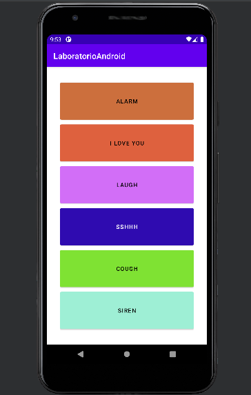

# Laboratorio Android

El presente trabajo corresponde al laboratorio introductorio a Android, en el cual se desarrolló una aplicación que cuenta con 6 botones, cada uno con su propio sonido. Cada botón cambia de color cada vez que se oprime.

## Autor
Esteban Valverde Hernández, e.valverde95@hotmail.com
## Interfaz

La interfaz cuenta con 6 botones que cambian de color, la aplicación se llama LaboratorioAndroid y cada botón tiene un sonido asignado.

## Uso

Para correr la aplicación se recomienda el uso de Android Studio y se debe abrir el proyecto y ejecutarlo. El presente laboratorio se probó y ejecutó en Android Studio para Windows, utilizando el emulador como dispositivo, sin embargo la aplicación puede ser cargada en un dispositov real por medio de Android Studio.